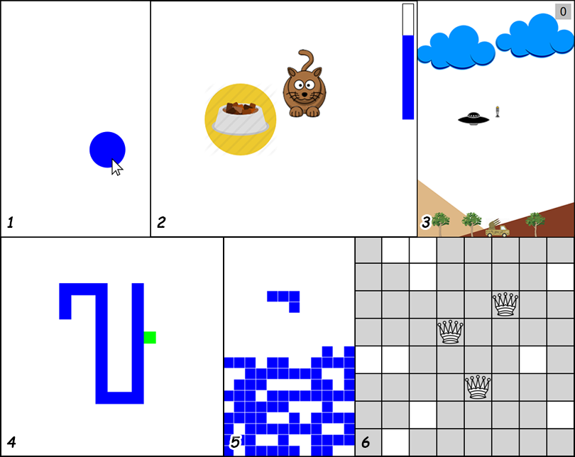

How to Design Programs
======================

This repository contains games that I made while reading «*How to Design Programs, 2e*» by *Matthias Felleisen*.
Also I wrote a review for each chapter of the book that contains the main ideas from the chapter.

## The list of games:

1. **Bouncing Ball** Use the mouse to throw a ball that bounces and slows down.
2. **Happy Cat** You feed and stroke a cat to make it happier.
3. **Space Invaders** Try to hit a landing UFO with a missle.
4. **Snake** You control a snake that eats fruit and grows.
5. **Tetris** A full-fledged version of tetris.
6. **Queens Puzzle** Place N queens on an NxN chess board.
