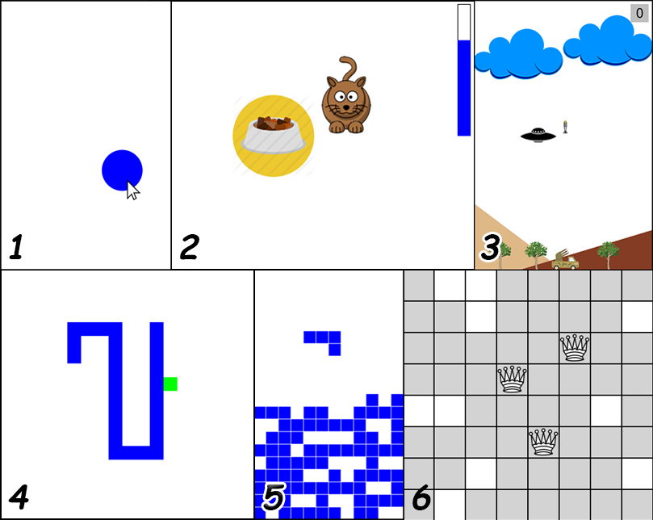

How to Design Programs
======================

This repository contains games that I made while reading *How to Design Programs 2e* by Matthias Felleisen.
Also I wrote a review for each chapter of the book that contains the main ideas of the chapter.

## The list of my games:

1. *Bouncing Ball* Description
2. *Cat* Description
3. *Space Invaders* Description
